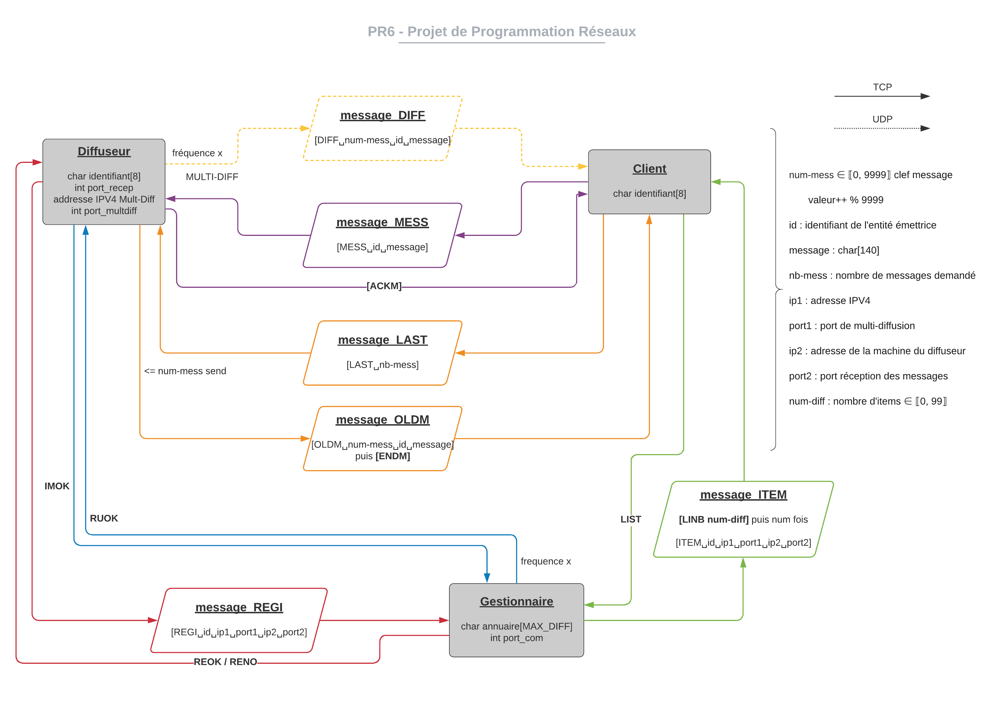

# Projet de Programmation Réseaux : NetRadio

Objectif du projet
-----------------------
Le but de ce projet est de programmer différentes entités mettant en place un service de diffusion de messages de 140 caractères. Il y aura trois types d’entités :
-   1. Des diffuseurs de messages
-   2. Des clients capable de recevoir les messages diffusés 
-   3. Des gestionnaire de diffuseurs de messages

Les diffuseurs enverront en multi-diffusion des messages en continu, ils pourront aussi envoyer des messages d’utilisateurs et renvoyer les derniers messages à un utilisateur sur demande. 

Les gestionnaires auront chacun une liste de diffuseurs (avec leurs caractéristiques) et pourront transmettre cette liste aux clients qui la demanderont. Ils devront aussi s’assurer que les diffuseurs présents dans la liste sont encore actifs.

Les clients devront être capable d’écouter les messages des diffuseurs, de leur envoyer des messages par- ticuliers, de leur demander une liste des derniers messages et d’interroger les gestionnaires pour récupérer des informations sur les diffuseurs.

Diagramme du projet
----------------------

Tester son mini-projet
----------------------

